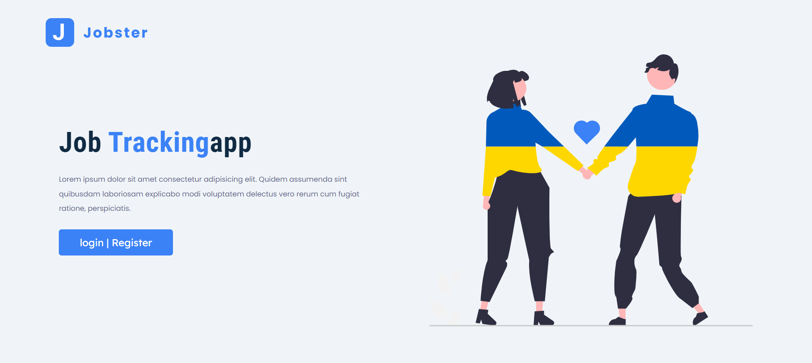

# Jobster - Job Search Web App



## Introduction

Welcome to the Jobster repository! Jobster is a powerful job search web application built with Node.js, Express, MongoDB, and Pug templates. It utilizes REST APIs to perform CRUD actions and implements role-based actions for recruiters, normal users, and administrators. This repository showcases the codebase, features, and technologies used to create a seamless job searching experience for users.

## Table of Contents

- [About Jobster](#about-jobster)
- [Features](#features)
- [Technologies Used](#technologies-used)
- [Installation](#installation)
- [Usage](#usage)
- [Roles and Permissions](#roles-and-permissions)
- [Contact](#contact)

## About Jobster

Jobster is a comprehensive job search web application that connects job seekers with employers and recruiters. It provides an intuitive interface for users to explore job listings, apply to vacancies, and manage their profiles effectively.

## Features

- **Job Listings:** Browse through a vast collection of job listings with detailed descriptions and requirements.

- **User Profiles:** Create and manage user profiles with relevant skills, experiences, and qualifications.

- **Job Applications:** Apply to job openings through the platform and track application status.

- **Recruiter Dashboard:** Recruiters can post job openings, manage applications, and review candidate profiles.

- **User Authentication:** Secure user registration and login functionality.

- **Role-Based Access:** Different access levels for recruiters, normal users, and administrators.

- **Responsive Design:** Enjoy a seamless experience on various devices, including desktops, tablets, and smartphones.

## Technologies Used

- **Frontend:** HTML, CSS, JavaScript (Client-side rendering using Pug templates).

- **Backend:** Node.js, Express (REST API).

- **Database:** MongoDB.

- **Authentication:** JSON Web Tokens (JWT).

## Installation

To run Jobster locally on your machine, follow these steps:

1. Clone this repository to your local system:

```bash
git clone https://github.com/YourUsername/Jobster.git
```

2. Navigate to the project directory:

```bash
cd Jobster
```

3. Install the required dependencies:

```bash
npm install
```

4. Set up your MongoDB database and provide the connection URI in the configuration file.

## Usage

To start the development server and explore Jobster:

```bash
npm start
```

Visit `http://localhost:3000` in your web browser to access the application.

## Roles and Permissions

Jobster implements the following roles and corresponding permissions:

- **Recruiters:** Can post job openings, manage applications, and review candidate profiles.

- **Normal Users:** Can browse job listings, apply to vacancies, and manage their profiles.

- **Administrators:** Have full access to manage job listings, user profiles, and system settings.

Please ensure to set up appropriate users and roles during deployment.

## Contribution

We welcome contributions and feedback from the community to make Jobster even better. If you find any issues or have suggestions for improvement, feel free to open an issue or submit a pull request.

---

Thank you for exploring Jobster! If you have any questions or inquiries, please don't hesitate to contact us. Happy job searching! 😊
